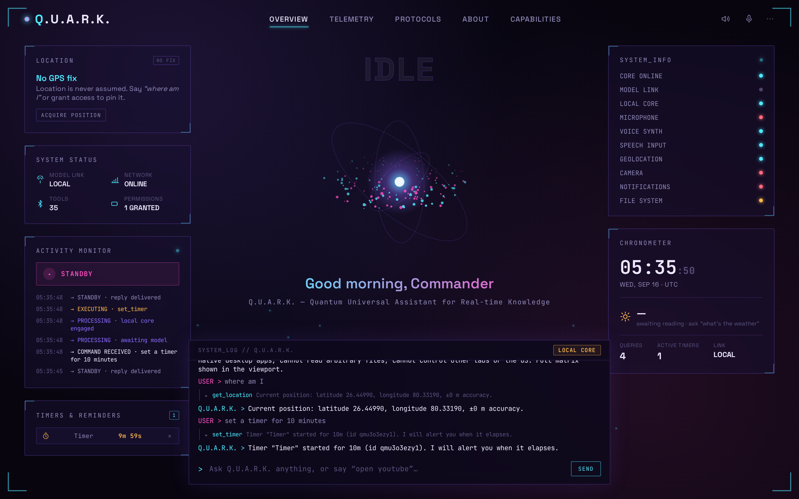
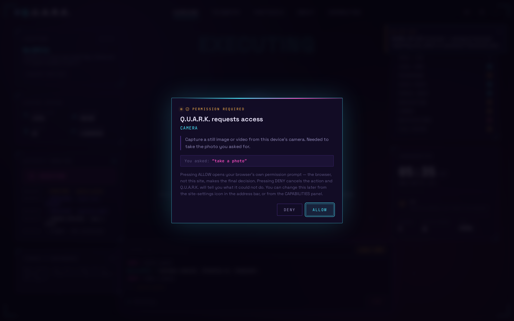
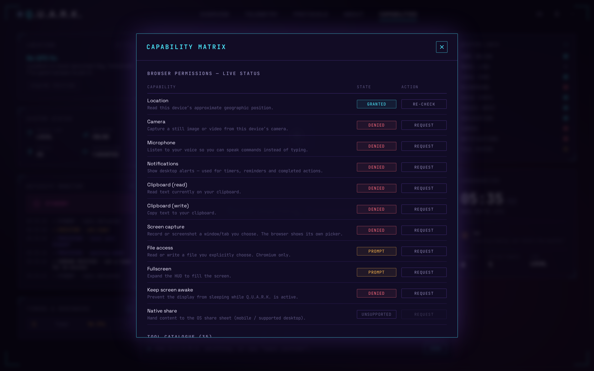
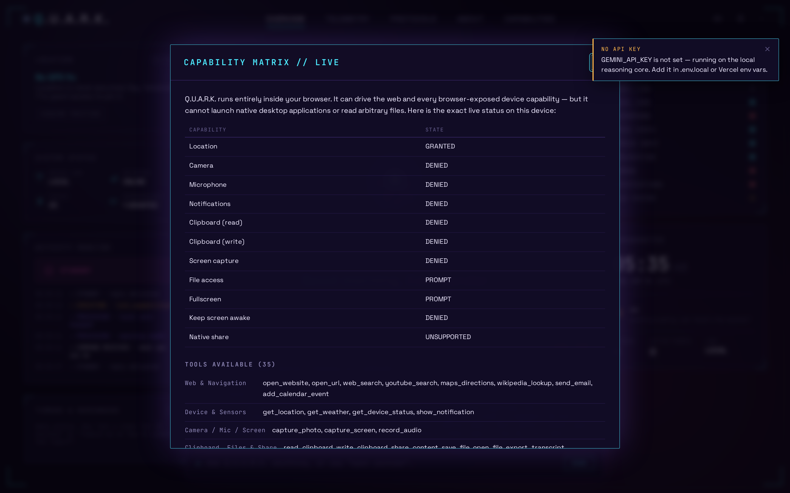
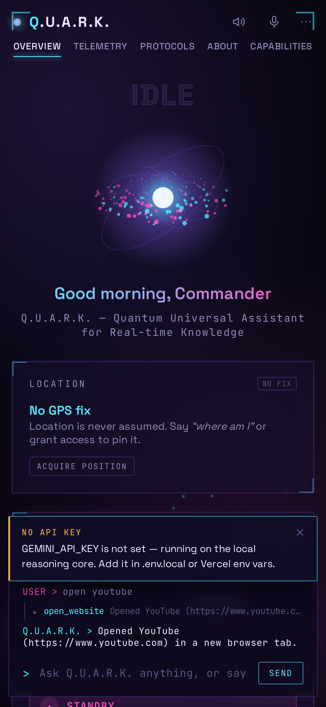
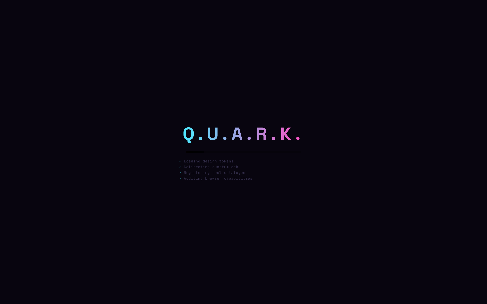

<div align="center">

# Q.U.A.R.K.

**Quantum Universal Assistant for Real-time Knowledge**

A voice-and-text HUD personal assistant — Next.js 16 · React 19 · Gemini function calling
**35 real browser tools · streaming · permission broker · offline fallback**

Team ID `27_CSAI_4B_06` · Pranveer Singh Institute of Technology · AI & DS · 2026–27

</div>

---

## Screens

| | |
|---|---|
|  | Main HUD — real telemetry, live activity log, an active timer, and a tool trace showing `get_location` returning genuine GPS coordinates |
|  | The permission broker: capability, reason, and the user's own words — shown *before* the native prompt |
|  | Live capability matrix + the full 35-tool catalogue, per-browser |
|  | The viewport presenting a generated capability report |
|  | 390 px — single column, zero horizontal overflow |
|  | Boot sequence while the capability audit + backend probe run |

---

## What it does

Type or **speak** a command. Q.U.A.R.K. reasons with Gemini, decides which tools
to call, executes them **in your browser**, feeds the results back, and answers —
aloud and in text.

```
"open youtube"                       → opens a tab
"play lofi hip hop"                   → YouTube, first result
"search react server components"      → Google results
"directions to Delhi from Kanpur"     → Google Maps, transit
"where am I"                          → GPS fix (permission dialog first)
"what's the weather"                  → live Open-Meteo forecast
"take a photo"                        → camera → HUD viewport + download
"screenshot my screen"                → getDisplayMedia → viewport
"read my clipboard"                   → clipboard-read
"save this transcript to a file"      → File System Access API / download
"set a timer for 10 minutes"          → real timer + notification
"remind me at 9pm to submit"          → persisted reminder
"show me a study plan for finals"     → rendered as structured blocks
"calculate (45*12) + sqrt(144)^2"     → 684
"what can you do"                     → live capability matrix
```

English and Hinglish both resolve — `youtube kholo`, `instagram kholo`,
`shukriya`, `namaste`.

---

## Quick start

```bash
npm install
cp .env.local.example .env.local      # then paste your key
npm run dev                           # http://localhost:3000
```

Get a free key: **<https://aistudio.google.com/apikey>**

No key? It still runs — see [Offline mode](#offline-mode).

---

## Architecture

```
Browser (React 19)                              Vercel serverless (Node)
┌────────────────────────────────────┐         ┌──────────────────────────────┐
│ Terminal · Voice input             │         │ app/api/chat/route.js        │
│   │                                │  POST   │  • reads the key(s)          │
│   ├─ SpeechRecognition             │ /api/   │  • origin allowlist          │
│   ├─ on-device Whisper (WASM/GPU)  │  chat   │  • rate limit                │
│   └─ /api/transcribe (last resort) ├────────▶│  • payload validation        │
│   │                                │   SSE   │  • provider + auto-failover  │
│   ▼                                │◀────────┤                              │
│ lib/engine.js — local-first router │         └───────┬──────────────┬───────┘
│   (answers without any API call)   │                 │              │
│   │ confidence < 0.85              │                 ▼              ▼
│   ▼                                │       generativelanguage   api.groq.com
│ useQuark — agentic loop            │        .googleapis.com     (or OpenRouter,
│   │                                │                            Ollama, your VM)
│   ▼                                │
│ executeTool() ── permission broker │
│   │                                │
│   ▼                                │
│ 37 browser actions                 │
└────────────────────────────────────┘
```

The key exists **only** in the server function. `GEMINI_API_KEY` has no
`NEXT_PUBLIC_` prefix, so Next.js never inlines it into client code. Verified by
grepping every built chunk — see [DEPLOYMENT.md §3](DEPLOYMENT.md#3-where-the-key-lives-and-proof-it-never-leaks).

### File map

```
app/
  layout.jsx                  metadata, fonts, CSP-friendly head
  page.jsx                    HUD shell
  globals.css                 design system (ported from the original)
  api/chat/route.js           model proxy — one of two files that see a key
  api/transcribe/route.js     last-resort speech-to-text (audio → Gemini)
components/
  TopBar  Terminal  QuantumOrb  LeftColumn  RightColumn
  InfoOverlay      Telemetry · Protocols · Capabilities · About
  Viewport         where content/photos/captures are presented
  ViewportBlock    typed allowlisted renderer (no innerHTML anywhere)
  PermissionDialog the in-HUD "what & why" gate before the native prompt
  Modal            focus trap · restore · aria-modal · Escape
  BootScreen  Toasts  Backdrop  Icons
lib/
  engine.js           local-first intent router (scored, Hinglish + typos)
  tool-selection.js   per-turn tool subset (free-tier token budget)
  tools.js            37 functionDeclarations + runtime metadata
  executor.js         functionCall → browser action → functionResponse
  permissions.js      capability registry + 5-step broker
  calc.js             recursive-descent parser (no eval)
  local-stt.js        on-device Whisper (Transformers.js, WebGPU → WASM)
                      silence gate + hallucination filter
  gemini-client.js    SSE client for /api/chat
  llm-openai.js       OpenAI-compatible adapter (Groq, Ollama, …)
  offline-brain.js    thin shim re-exporting engine.js
  system-prompt.js    persona + tool index (server-only)
  constants.js        team, sites registry, states
  actions/            web · device · io · hud · utility
hooks/
  QuarkProvider.jsx   orchestrator (agentic loop, cache, quota handling)
  useSpeech  useClock  useTimers  useToasts  useActivityLog
tests/
  unit-calc.mjs  unit-offline-brain.mjs
  e2e-browser.mjs  e2e-local-stt.mjs  e2e-providers.mjs
  e2e-live-model.mjs  mock-gemini-server.mjs  mock-openai-server.mjs
  fixtures/speech-16k.wav  real-speech sample for the on-device STT suite
```

---

## The 37 tools

| Category | Tools |
|---|---|
| **Web & Navigation** | `open_website` `open_url` `web_search` `youtube_search` `maps_directions` `wikipedia_lookup` `stackoverflow_search` `send_email` `add_calendar_event` |
| **Device & Sensors** | `get_location` `get_weather` `get_device_status` `show_notification` |
| **Camera / Mic / Screen** | `capture_photo` `capture_screen` `record_audio` |
| **Clipboard, Files & Share** | `read_clipboard` `write_clipboard` `share_content` `save_file` `open_file` `export_transcript` |
| **HUD Control** | `display_content` `navigate_panel` `set_hud_accent` `request_fullscreen` `clear_terminal` `list_capabilities` |
| **Voice** | `speak` `set_voice_listening` `set_voice_mode` |
| **Utility** | `calculate` `get_datetime` `set_timer` `set_reminder` `cancel_timer` `request_permission` |

Live status of every one, in this exact browser, is in the **CAPABILITIES** panel.

---

## Permission broker

The browser's own prompt is terse and gives no context. Q.U.A.R.K. shows its own
dialog **first**:

```
┌────────────────────────────────────────────┐
│ ⚠ PERMISSION REQUIRED                      │
│ Q.U.A.R.K. requests access                 │
│ LOCATION                                   │
│                                            │
│ Read this device's approximate geographic  │
│ position. Needed to report your current    │
│ position.                                  │
│                                            │
│ You asked: "where am I"                    │
│                                            │
│              [ DENY ]   [ ALLOW ]          │
└────────────────────────────────────────────┘
```

Only on **ALLOW** does the native prompt fire. On **DENY** the model is told
permission was refused and explains what it could not do — it never fails
silently, and never retries a denied tool.

Flow: `detect → query → explain → trigger → report`. If a permission is already
`granted`, the dialog is skipped entirely.

---

## The local reasoning engine (no key, no network, no quota)

`lib/engine.js` is a scored intent router that runs entirely in the browser. It
handles the things a HUD assistant is asked constantly, so those queries never
touch a model API at all:

```
"date"                             → get_datetime      ✅ bare one-word query
"time now" / "what's the time"     → get_datetime      ✅
"calculate (45*12)+sqrt(144)^2"    → 684               ✅
"set a timer for 10 minutes"       → set_timer(600)    ✅
"weather in Kanpur"                → get_weather       ✅ (Open-Meteo, keyless)
"where am I"                       → get_location      ✅ (permission dialog still runs)
"open youtube"                     → open_website      ✅
"what is lion" / "who is Einstein" → wikipedia_lookup  ✅ (keyless, real article text)
"linux command for search"         → stackoverflow_search ✅ (how-to → SO, not Wikipedia)
"what is psi"                      → NEEDS_MODEL       ⤷ routed to the model
```

Design rules it follows:

- **Bare and twisted phrasings work.** `"date"`, `"aaj ki date"`, `"wat is the
  date"` and `"tell me todays date"` all resolve to the same intent — matching
  is scored over normalised text with filler words, Hinglish and common typos
  handled, not a single regex.
- **Wikipedia is for entities, Stack Overflow is for how-to.** Routing "linux
  command for search" to Wikipedia returns nothing useful; SO search with
  `sort=relevance` returns the actual command. Both are keyless, CORS-open APIs.
- **Confidence decides who answers.** At `LOCAL_FIRST_THRESHOLD` (0.85) or above
  the engine answers directly and **zero API calls are made**. Below it, the
  query is escalated to the model rather than guessed at.
- **Nothing is a dead end.** An unrecognised query falls through to
  `unknown_search`; an empty model answer produces an honest explanation, never a
  blank bubble and never a speculative search.

If the model link is down, out of quota, or unconfigured, the badge flips
**LIVE → LOCAL CORE** and this engine keeps the assistant useful.

**Safe to demo on bad college Wi-Fi.**

---

## Provider failover (no single vendor can dead-end you)

`/api/chat` speaks two protocols — `gemini` and `openai` (any OpenAI-compatible
host: Groq, OpenRouter, Cerebras, Mistral, Ollama, LM Studio, llama.cpp). Set a
fallback and a 429 or 5xx from the primary is retried on it automatically:

```bash
LLM_PROVIDER=openai                   # Groq — free, no card, 500+ tok/s
OPENAI_API_KEY=gsk_...
OPENAI_MODEL=llama-3.3-70b-versatile
LLM_FALLBACK_PROVIDER=gemini          # optional second line of defence
```

Rate limits are reported as a calm HUD toast, never a raw upstream error, and the
answer cache (LRU) means a repeated question costs nothing at all.

**Per-turn tool selection.** Declaring all 37 tools costs ~4,000 tokens of fixed
overhead on *every* round of the tool loop — enough on its own to exhaust a free
tier's tokens-per-minute cap (Groq allows 6K–12K TPM). So `lib/tool-selection.js`
declares only what the turn could plausibly use and rebuilds the system prompt
from the same subset:

| | all 37 tools | per-turn subset |
|---|---|---|
| Fixed overhead / round | ~5,150 tokens | **~1,500 tokens** |
| Rounds per minute on 12K TPM | 2 | ~8 |
| Turns per day on 100K TPD | ~19 | ~65 |

Tools already used in the conversation are always kept, so the provider never
sees a `tool_call` for an undeclared function. Tune with `QUARK_TOOL_BUDGET`
(default 14) or disable with `QUARK_SEND_ALL_TOOLS=1`. All 37 tools stay
reachable from natural wording — `tests/unit-tool-selection.mjs` (54 checks)
proves it one tool at a time.

**[LOCAL_LLM.md](LOCAL_LLM.md)** is the full guide to running a ~4 GB model for
free — on your own machine with Ollama, on a free always-on Oracle ARM VM, or
via a free hosted API — including which Groq models support function calling
(two of the highest-quota ones do not) and why Vercel itself cannot host the
weights.

---

## Voice input has three independent paths

Browser speech recognition is the most fragile feature on the web, so it is not
allowed to be a single point of failure — and none of the fallbacks need a model
API key:

| Path | How it works | Network | Fails when |
|---|---|---|---|
| **1. Built-in** | `SpeechRecognition` (Chrome/Edge/Safari) | ⚠️ audio streams to a cloud speech service | Firefox; a firewall or embedded frame blocks that uplink → the terse `network` error |
| **2. On-device Whisper** | `MediaRecorder` → `whisper-tiny.en` (≈45 MB, Transformers.js / ONNX, WebGPU when a real adapter exists, else WASM) | ✅ **none** — no upload, no key, no quota | First load needs the 45 MB download; no WebAssembly |
| **3. Server** | The same recording POSTed to `/api/transcribe`, which uses the Gemini key | ⚠️ upload + API key | No `GEMINI_API_KEY` on the server |

Switching is automatic and honest. If the recogniser neither starts nor errors
within 6 s (Chrome hangs silently when its speech service is unreachable), a
watchdog aborts it and path 2 takes over; the top bar shows the model download
progress, and path 3 is used only if the local model genuinely cannot run. The
transcript is then submitted exactly like a typed command.

**The ~41 MB of Whisper weights ship inside this repo** (`public/models/`), so the
first voice command needs no third party at all — the loader probes
`/models/onnx-community/whisper-tiny.en/` and only falls back to the Hugging Face
CDN if a slim checkout lacks them. `tests/e2e-local-stt.mjs` asserts that zero
model files ever come from a CDN.

Two guards keep the local model honest: a **silence gate** (RMS below threshold
→ no inference at all) and a **hallucination filter** (Whisper's subtitle-credit
artefacts and one-word noise like "You" are dropped instead of being submitted
as a command).

### On-device-only mode — voice with zero network services

Path 1 still sends audio to a cloud service (not yours, and it needs no key —
but it is not local either). To remove that dependency entirely, say:

```
"use offline voice"  /  "voice without internet"  /  "don't upload my audio"
"private voice mode" /  "switch to on-device speech"
```

That is handled by the local engine — the switch itself costs no API call — and
persists across reloads. While it is on:

- the built-in recogniser is **never started**, so the mic engages in ~250 ms
  instead of waiting out the 6 s watchdog;
- path 3 is **disabled**, so a recording the local model cannot read produces an
  honest explanation rather than being uploaded;
- `use normal voice mode` restores all three paths.

`tests/e2e-local-stt.mjs` (20 checks) proves the whole thing, including that
`SpeechRecognition.prototype.start` is never called in on-device mode, and that
8 s of real speech transcribes in-browser to *"And so, my fellow Americans ask
not what your country can do for you"* with **zero** network calls to any API.

**Text-to-speech is API-free too** — `speechSynthesis` is a browser primitive,
with the voice and rate preferences persisted in `localStorage`.

---

## Security

| Control | Detail |
|---|---|
| Key isolation | Server-only env var; proven absent from all client chunks |
| **No `innerHTML`** | Zero occurrences project-wide. Model output goes through a typed block renderer; all text lands as React text nodes |
| URL allowlist | `open_url` accepts only `http/https/mailto/tel/sms` — blocks `javascript:` and `data:` |
| Media allowlist | `image`/`audio` blocks are only ever produced internally; the model cannot inject remote tracking pixels |
| No `eval` | `lib/calc.js` is a hand-written tokenizer + recursive-descent parser |
| CSP | `default-src 'self'`, `object-src 'none'`, `frame-ancestors 'self'`, scoped `connect-src` |
| Headers | `X-Content-Type-Options`, `X-Frame-Options`, `Referrer-Policy`, `Permissions-Policy` |
| Origin allowlist | `QUARK_ALLOWED_ORIGINS` stops other sites driving your key |
| Rate limit | `QUARK_RATE_LIMIT_PER_MIN` per IP |
| Payload caps | 512 KB body, 60 messages, 32 KB/text part, 6 tool rounds |
| Upstream timeout | `AbortController`, 45 s default |
| `noopener` | Every `window.open` and `target="_blank"` |

### XSS proof

The original prototype concatenated raw model output into `innerHTML`. Payload tested live:

```js
''
```

```
✅ payload rendered as inert text (no  in terminal) — img elements: 0
✅ onerror never fired — __PWNED=undefined
✅ raw markup is visible as text, proving it was escaped
✅ no inline event handlers or scripts in the transcript
```

---

## Accessibility

- `role="log"` + `aria-live="polite"` on the terminal and activity monitor — replies are announced
- `role="dialog"` + `aria-modal` + `aria-labelledby`, focus moved in, **trapped**, and **restored** on close
- `role="alertdialog"` on the permission prompt
- `aria-pressed` on both toggle buttons; `aria-current` on nav
- Nav uses real `<button>`s, not `<a href="#">`
- Visible `:focus-visible` ring (the original had `outline:none` with no replacement)
- `prefers-reduced-motion` renders a single static orb frame and disables all animation
- Canvas is `devicePixelRatio`-aware and pauses in hidden tabs
- Every form control has a label; decorative SVGs are `aria-hidden`
- Tested at 1440 / 1024 / 820 / 390 px — zero horizontal overflow

---

## Testing

```bash
npm test                # calculator (34) + engine routing (69) + tool selection (54)
npm run test:e2e        # 64 browser checks — needs the app on :3000
npm run test:stt        # 21 on-device speech checks (real speech, self-hosted weights, zero API)
npm run test:providers  # 18 provider/failover + wire-payload checks (own mocks)
npm run test:live       # 27 checks against a mock Gemini, exercises the real loop
npm run test:all        # lint + build + everything above
```

All suites drive headless Chromium through Playwright. Coverage: boot, tool
routing, web actions, both permission paths, XSS, a11y, four breakpoints,
console hygiene, the local-first zero-API guarantees, on-device STT accuracy,
multi-provider failover, and a mock Gemini that also simulates thinking-model
output (`{"thought":true}` parts, `MAX_TOKENS`) and a blocked speech service —
so the fallbacks are tested rather than assumed.

**Current: 34 + 78 + 55 unit · 64/64 browser · 21/21 on-device STT · 18/18
providers · 26/27 live-model.** The one live skip is correct-by-design: the permission
dialog is not shown when geolocation is already `granted`.

---

## Environment

| Variable | Default | Purpose |
|---|---|---|
| `GEMINI_API_KEY` | — | **Server-only.** Free at [aistudio.google.com/apikey](https://aistudio.google.com/apikey) |
| `GEMINI_MODEL` | `gemini-2.5-flash` | Try `gemini-3.8-flash` (newest) or `gemini-3.5-flash-lite` (cheapest) |
| `GEMINI_API_BASE` | `https://generativelanguage.googleapis.com/v1beta` | Swap for Vertex AI |
| `LLM_PROVIDER` | `gemini` | `gemini` or `openai` (any OpenAI-compatible host) |
| `LLM_FALLBACK_PROVIDER` | *(empty)* | Used automatically on 429/5xx from the primary |
| `OPENAI_API_KEY` | — | Groq / OpenRouter / Ollama / your own server |
| `OPENAI_BASE_URL` | `https://api.groq.com/openai/v1` | Any OpenAI-compatible endpoint |
| `OPENAI_MODEL` | `llama-3.3-70b-versatile` | e.g. `qwen3:4b` for Ollama |
| `OPENAI_MAX_TOKENS` | `2048` | Reply budget for the OpenAI-shaped provider |
| `QUARK_TOOL_BUDGET` | `14` | Max tool declarations per turn (free-tier TPM saver) |

**When a provider "is attached but not working"**, `GET /api/chat` answers with a
`diagnostics` object that says exactly why — key present? length? stray newline?
wrong prefix for the chosen host? — plus a one-sentence `issues` list, without
ever echoing the key itself. The HUD's startup toast shows the first issue
verbatim.
| `QUARK_SEND_ALL_TOOLS` | `0` | `1` declares all 37 tools every turn (debugging) |
| `QUARK_MAX_TOOL_ROUNDS` | `6` | Tool-loop ceiling per turn |
| `QUARK_UPSTREAM_TIMEOUT_MS` | `45000` | Upstream abort |
| `QUARK_ALLOWED_ORIGINS` | *(empty)* | Comma-separated origin allowlist |
| `QUARK_RATE_LIMIT_PER_MIN` | `20` | Per-IP throttle |

Full variable list with comments: [`.env.local.example`](.env.local.example). Free-model hosting: [`LOCAL_LLM.md`](LOCAL_LLM.md).

---

## Deploying

Full walkthrough in **[DEPLOYMENT.md](DEPLOYMENT.md)** — request flow, key
isolation proof, HTTPS requirements, per-capability browser support, the
popup-blocking fix, cost estimates, and hardening checklist.

Short version:

```bash
git push                                  # .env* is already git-ignored
# vercel.com/new → import → add GEMINI_API_KEY → Deploy
curl https://your-app.vercel.app/api/chat  # "configured": true
```

---

## Design

The visual language is **preserved exactly** from the original prototype — same
palette tokens, same Space Grotesk + JetBrains Mono pairing, same panel corner
brackets, drifting specks, quantum orb and terminal. Additions are confined to
new subsystems (permission dialog, viewport, toasts, boot, capability matrix)
and follow the same tokens.

The only intentional deviations are accessibility fixes that don't alter the
mouse-driven appearance: a keyboard-only focus ring, and the two contrast-failing
text tokens are now used for decoration rather than body copy.

---

## Team

| Name | Roll No. | Role |
|---|---|---|
| Gyanvikas Singh | 2301641520076 | Team Leader |
| Rupendra Singh Sengar | 2301641520151 | Member |
| Manas Mani Ojha | 2301641520110 | Member |
| Mukul Upamanyu Dwivedi | 2301641520120 | Member |
| Aryan Shukla | 2301641520048 | Member |

---

## Roadmap

- [ ] Gemini **Live API** for full-duplex voice (barge-in, no push-to-talk)
- [ ] `gemini-3-pro-image` tool — generate images into the viewport
- [ ] Google **Search grounding** tool for cited live answers
- [ ] Wake word via a small on-device keyword spotter
- [ ] PWA manifest + service worker for true installability
- [ ] Tauri companion for native desktop control (same tool protocol)
- [ ] Upstash Redis rate limiting
